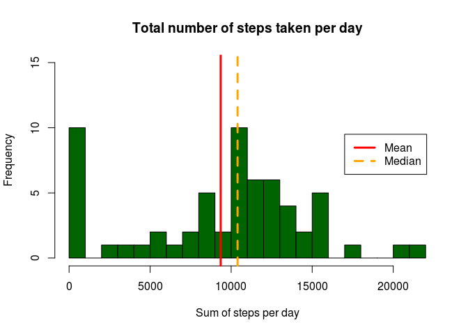
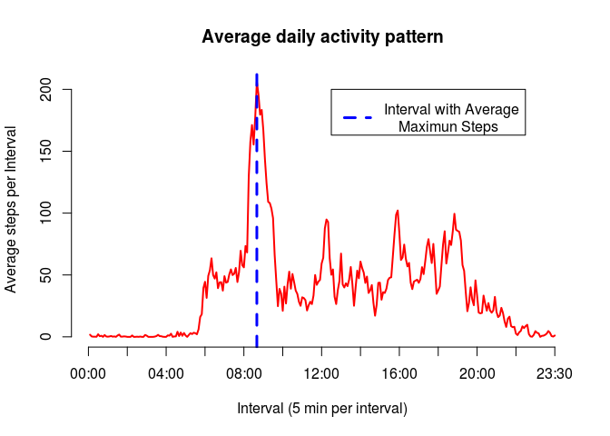
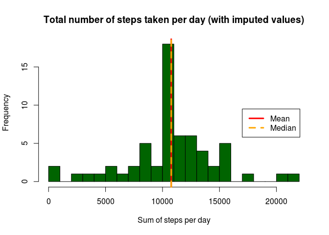
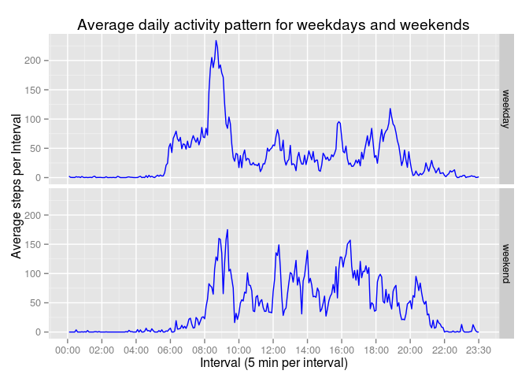

# Reproducible Research: Peer Assessment 1

This report is an answer to the **Reproducible Research: Peer Assessment 1** assignment completed as part of the [Reproducible Research] [1] course in the [Data Science Specialization][2] offered by [Coursera][3] and run by [Johns Hopkins University][4].  

The data used in this report is from personal activity monitoring devices like Fitbit, Nike Fuelband or Jawbone Up. 
This data consists of two months of daily readings taken at five minute intervals between October 2012 and November 2012. 

Instructions for completing this assignment are located in the **Reproducible Research: Peer Assessment 1** section of the course website or in the README in this repo.

### **Loading and preprocessing the data**
The data set for this assignment is available at the course website 
- [Activity monitoring data](https://d396qusza40orc.cloudfront.net/repdata%2Fdata%2Factivity.zip) [52K]

The zip file containing the data was also provided with the forked repository from Github. Both files were compared and found to be the same. The zip file from the repository was used for this report.

The data was unzipped and loaded from the zip file. The data file was pre-processed to fill empty variables with NA's. 

```r
# Read the data from zip file
 mydata <- read.csv(unzip("activity.zip","activity.csv"), header = TRUE,
                   na.strings=c(NA,""), stringsAsFactors=FALSE )
```


### **What is mean total number of steps taken per day?**


```r
# Create a sum of the steps per day
 steps.per.day.sum <- aggregate(mydata$steps, by=list(Date=mydata$date), FUN=sum, na.rm=TRUE)
 names(steps.per.day.sum)[2] <- "steps"
# Calculate means and median steps per day
 mean.steps.per.day <- mean(steps.per.day.sum$steps, na.rm=TRUE)
 median.steps.per.day <- median(steps.per.day.sum$steps, na.rm=TRUE)
```


The mean total number of steps taken per day is **9354.23**. Instructions for this part of the assignment advised that missing values can be ignored in the dataset. Calculations for this question included *na.rm=TRUE* to ignore the missing values.

The histogram below show shows the frequency distribution of the quantative variable *steps* which is the sum of steps per day. The two vertical lines indicate the mean and median values of the sum of the steps per day.

The calulated value for mean and median of the total number of steps taken per day are as follows.

Mean of the total number of steps taken per day : **9354.23**  
Median of the total number of steps taken per day: **10395**  


```r
# Draw the histogram
 hist(steps.per.day.sum$steps, breaks = 20, col = "darkgreen",xlab = "Sum of steps per day",
     ylim=c(0,15), main="Total number of steps taken per day")
# Add the mean line
 abline(v = mean.steps.per.day,col="red",lwd=3,lty=1 )
# Add the median line
 abline(v = median.steps.per.day,col="orange",lwd=3,lty=2)
# Add the Legend
 legend(17000,9.5, c("Mean","Median"),lty = c(1,2),lwd = c(3,3),col = c("red","orange") )
```

 

### **What is the average daily activity pattern?**


```r
# Create a new factor variable with the time in the required format
 mydata$mytime <- as.factor(substr(as.POSIXct(sprintf("%04.0f", mydata$interval), format='%H%M'), 12, 16))
# Create an average of the steps per day.
 mean.interval <- aggregate(mydata$steps, by=list(mydata$mytime), FUN=mean, na.rm=TRUE)
# Fix the column headings
 names(mean.interval) <- c("interval","average.steps")
# Calculate interval for average maximum steps
 max.steps <- mean.interval[which(mean.interval$average.steps==max(mean.interval$average.steps,na.rm = TRUE)),][[1]]
```
#### **Average maximum number of steps taken per day**
The chart below shows the average daily activity pattern for the study period. The data shows the main span of activity is between 05:40 and 20:00. 
  
The interval with the average maximum number of steps taken per day is **08:35**.  


```r
# Create the main plot
 plot(as.numeric(mean.interval$interval),mean.interval$average.steps,type = "l",col = "red",lwd = 2, xlab = "Interval (5 min per interval)", ylab="Average steps per Interval", 
      main="Average daily activity pattern",axes=FALSE)
# Add the mean line
 abline(v = max.steps,col="blue",lwd=3,lty=2 )
# Add the Legend
 legend(150,200, "Interval with Average\n    Maximun Steps",lty = 2,lwd = 3 ,col = "blue" )
# Set the breaks for the x axis
 xxbreak <- seq(0,288,by=24)
# Set the labels for the x axis
 xxlab <- c("00:00","02:00","04:00","06:00","08:00","10:00","12:00","14:00","16:00","18:00","20:00",
            "22:00","23:30")
# Create the x axis
 axis(1, at = xxbreak, labels = xxlab)
 # Create the y axis
 axis(2)
```

 

### **Imputing missing values**


```r
# Calculate the number of missing values
mynas <- sum(is.na(mydata$steps))
```
The calculated number of missing values in the dataset (i.e. the total number of rows with NAs) is **2304.** 

```r
# Load library
 suppressMessages(library(dplyr))
# Make a copy of the main dataset to work with
 mytmp <- mydata
# Change steps to numeric
 mytmp$steps <- as.numeric(mytmp$steps)
# Create a data frame of the average daily steps per interval
 mean.interval <- aggregate(mydata$steps, by=list(mydata$interval), FUN=mean, na.rm=TRUE)
# Fix column names
 names(mean.interval) <- c("interval","average.steps")
# Replace NA's with with the average daily steps for the time period 
 for (i in 1:nrow(mytmp)){
        if (is.na(mytmp$steps[i])) {
                mytmp$steps[i] <- filter(mean.interval,interval==mytmp$interval[i])$average.steps
        }
}
```
#### **Missing Values Imputing Strategy**
The strategy I selected for imputing missing (filling in all of the missing values) in the dataset was to use the mean number of steps for the 5 minute interval.  This will assign a value of the 5 minute mean number of steps to the intervals without readings which should give a better estimate of the total number of steps in the study period. 


```r
 steps.per.day.sum.impute <- aggregate(mytmp$steps, by=list(Date=mytmp$date), FUN=sum, na.rm=TRUE)
 names(steps.per.day.sum.impute)[2] <- "steps"
 
 mean.steps.per.day.impute <- mean(steps.per.day.sum.impute$steps,na.rm=TRUE)
 median.steps.per.day.impute <- median(steps.per.day.sum.impute$steps,na.rm=TRUE)
```


A new dataset was created that is equal to the original dataset but with the missing data filled in. A new histogram was created using the new dataset.
 
 

```r
 hist(steps.per.day.sum.impute$steps, breaks = 20, col = "darkgreen",xlab = "Sum of steps per day",
      main="Total number of steps taken per day (with imputed values)")
 abline(v = mean.steps.per.day.impute,col="red",lwd=3,lty=1 )
 abline(v = median.steps.per.day.impute,col="orange",lwd=3,lty=2)
 legend(17000,9.5, c("Mean","Median"),lty = c(1,2),lwd = c(3,3),col = c("red","orange") )
```

 

The calulated values for mean and median of the total number of steps, taken per day, with the imputed values are as follows.

 Mean of the total number of steps taken per day: **10766.19**  
 Median of the total number of steps taken per day: **10766.19**  
 
The values of mean and median for this part of the assignment have increased from the estimates calculated in the first part of the assignment. The mean and the median values for this part of the assignment are also equal.

The impact of imputing missing data has moved values from the first bin into the bin where the of the median and mean lie. The value of the first bin has decreased and the value of the *mean* bin has increased. This implies the estimates for the total daily number of steps has increased.  


### **Are there differences in activity patterns between weekdays and weekends?**

The chart below shows the differences in the daily activity pattern for weekdays and weekends. On weekdays  the data shows the main span of activity is between 05:40 and 20:00. On weekends the daily activity pattern starts at around 07:30 and decreases from about 21:30.


The interval with the maximum average number of steps taken per day is still on a weekday. 


```r
# Load Libraries
library(ggplot2)
library(scales)
# Change date to a Date type
mydata$date <- as.Date(mydata$date)
# Create a new factor variable called period for the weekend and weekday data 
mydata$period <- grepl("Saturday|Sunday",weekdays(mydata$date))
mydata$period <- ifelse(mydata$period == FALSE, "weekday", "weekend")
# Subset the  weekend and weekday date
mydata.weekend <- filter(mydata,period == "weekend")
mydata.weekday <- filter(mydata,period == "weekday")
# Create an average of the steps per day for weekend.
mean.interval.weekend <- aggregate(mydata.weekend$steps, by=list(mydata.weekend$mytime,mydata.weekend$period),
                                   FUN=mean, na.rm=TRUE)
# Create an average of the steps per day for weekday
mean.interval.weekday <- aggregate(mydata.weekday$steps, by=list(mydata.weekday$mytime,mydata.weekday$period),
                                   FUN=mean, na.rm=TRUE)
# Fix Column names
names(mean.interval.weekend) <- c("interval","period","average.steps")
names(mean.interval.weekday) <- c("interval","period","average.steps")
# Join the mean weekend and weekend tables together
mean.interval <- rbind(mean.interval.weekend,mean.interval.weekday)
# Set the labels for the x axis
xxlab <- c("00:00","02:00","04:00","06:00","08:00","10:00","12:00","14:00","16:00","18:00","20:00",
           "22:00","23:30")
# Set the breaks for the x axis
xxbreak <- seq(0,288,by=24)
```


```r
# Create the plot
g <- ggplot(data = mean.interval,aes(x=as.numeric(interval),y=average.steps))
# Draw the plot line and create the panel plot
g + geom_line(color="blue") + facet_grid(period ~ .) +
# Create the x axis
    scale_x_continuous(breaks = xxbreak, labels= xxlab) +
# Create the plot labels
    labs(title = "Average daily activity pattern for weekdays and weekends", 
         x = "Interval (5 min per interval)",y = "Average steps per Interval")
```

 

[1]: https://class.coursera.org/repdata-014/ "Reproducible Research"
[2]: https://www.coursera.org/specialization/jhudatascience/1?utm_medium=listingPage "Data Science Specialization"
[3]: https://www.coursera.org/ "Coursera" 
[4]: https://www.jhu.edu/ "Johns Hopkins University"
